# Что реализовано:

## Заметки

  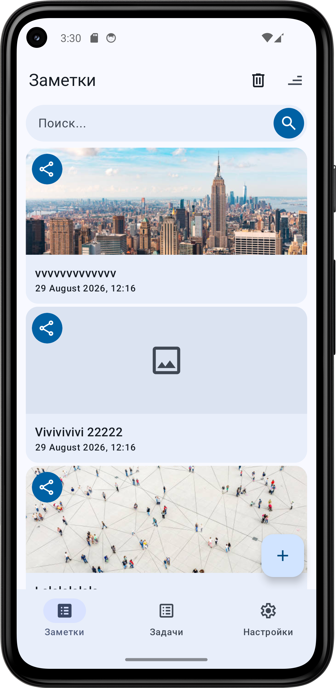
  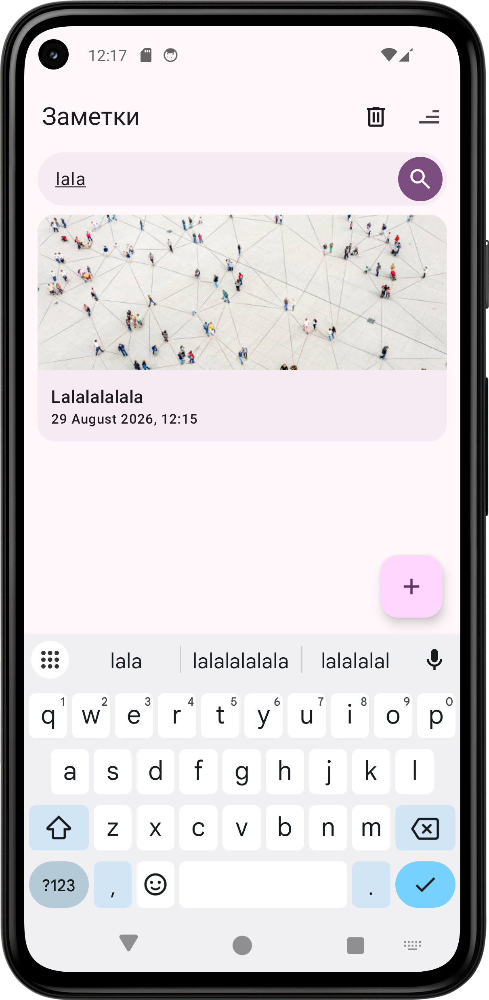
  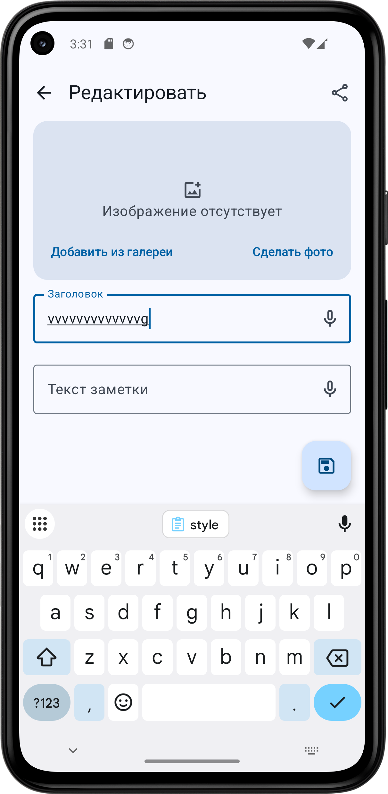
  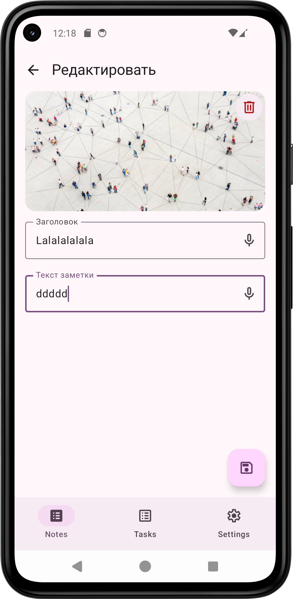

### Экран списка заметок
- список заметок: каждая заметка имеет название, дату, картинку
- FAB - переносит на экран создания новой заметки
- строка поиска (поиск после нажатия на кнопку поиска)
- кнопка сортировки
- кнопка режима удаления
- по нажатию на заметку открывается экран редактирования заметки

### Экран создания заметки (он же экран редактирования заметки)
- поля ввода для названия и описания
- возможность добавить картинку из галереи или с помощью камеры (примечание: Добавление изображений)
- предпросмотр выбранного изображения
- возможность удалить картинку (если она добавлена)
- если название заполнено - заметку можно сохранить с помощью FAB
- при ошибках сохранения появляется сообщение об ошибке
- возможность надиктовать текст голосом (примечание: Распознавание речи)

## Задачи

  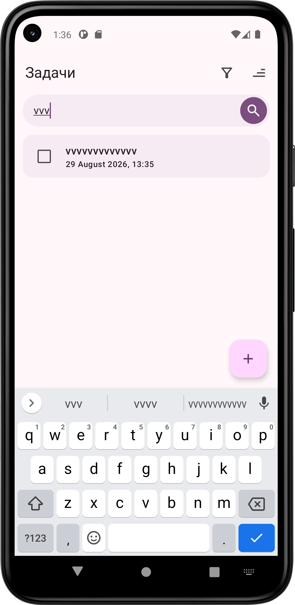
  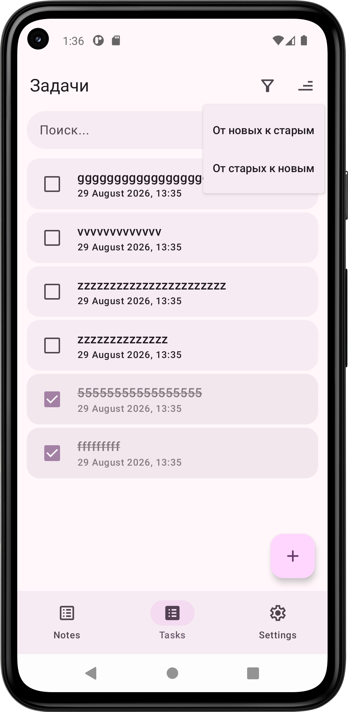
  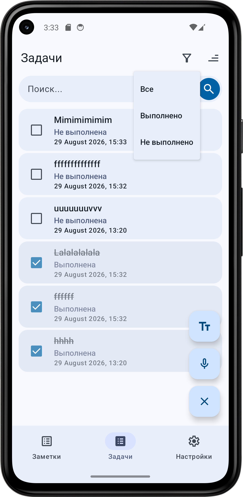
  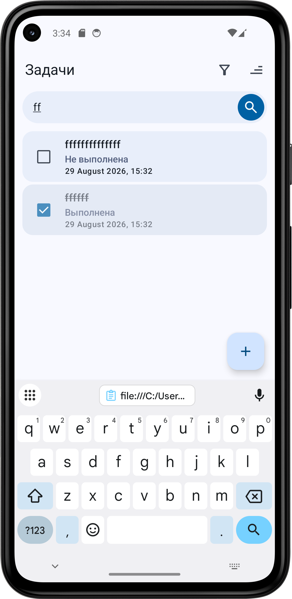

### Экран списка задач

- список задач
- поиск по названию задачи
- кнопка сортировки
- кнопка фильтрации по статусу задачи
- FAB для создания задачи
- нажатие на FAB (+) показывает варианты создания задачи: текстом и голосом
- при создании задачи текстом появляется элемент с полем ввода названия задачи, кнопкой сохранить и кнопкой отменить
- при создании задачи голосом происходит распознавание речи (примечание: Распознавание речи), затем распознанный текст отправляется в GigaChat, который формирует текст задачи

## Настройки

  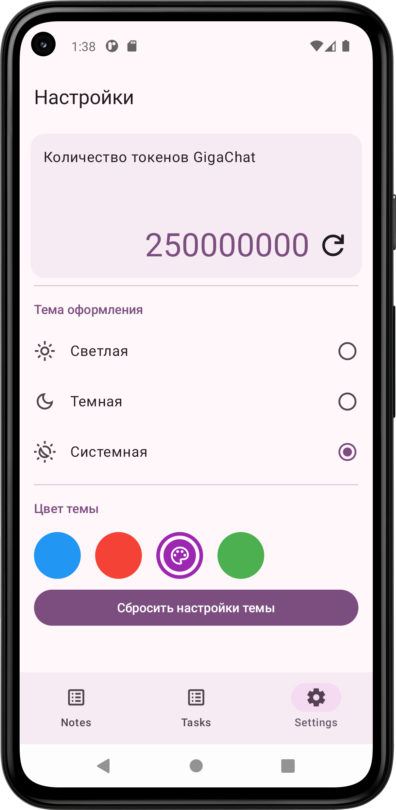
  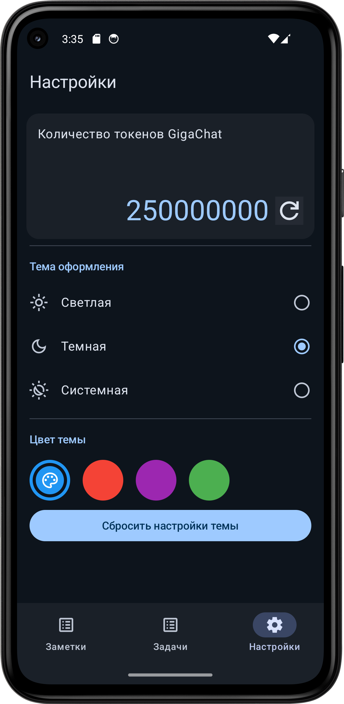
  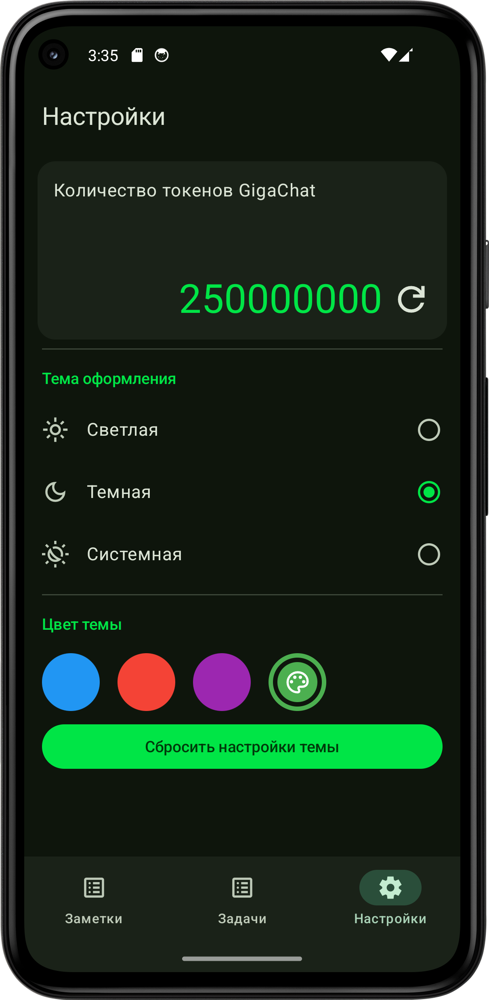
  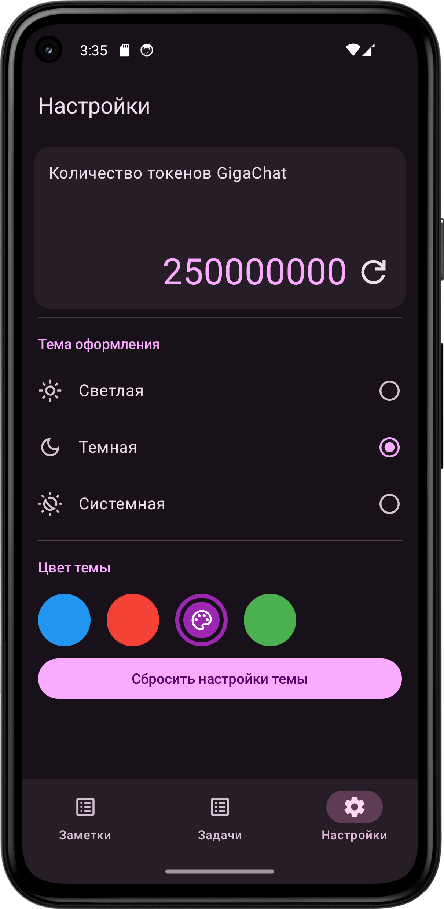

### Экран настроек
- Карточка с балансом GigaChat
- Цвета оформления: на выбор 4 цвета (Примечание: Цвета оформления)
- Тема: ночь, день, авто
- Кнопка сброса настроек темы

## Дополнительно

### SplashScreen
- На Android 12+ показывается анимированный SplashScreen (Используется SplashScreen API)
- На Android 11 показывается статичный SplashScreen

### Поделиться заметкой
- По нажатию на кнопку отправки можно поделиться заметкой

### Подтверждение удаления
- Перед удалением заметки показывается Alert Dialog

# Примечания

### Распознавание речи

Подключить [SaluteSpeech API](https://developers.sber.ru/docs/ru/salutespeech/quick-start/integration-individuals) мне не удалось.
> С 15 июля 2026 года подключение для новых клиентов недоступно.

> 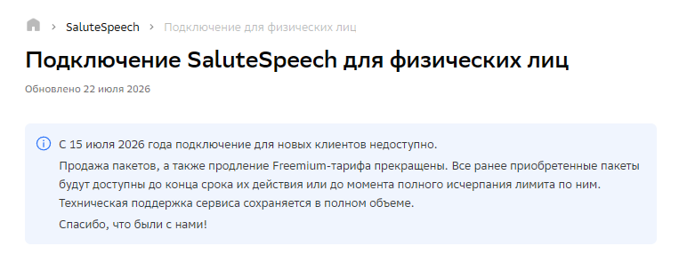

К сожалению, это я заметил не сразу: было потрачено много времени на изучение документации SaluteSpeech, прежде чем я понял, что использовать SaluteSpeech не получится. 

В связи с этим, было решено использовать стандартное распознавание речи Google.
Это также означает, что приложение не нуждается в разрешении на доступ к микрофону.

### Цвета оформления

Для реализации цветов оформления использовалась библиотека [MaterialKolor](https://github.com/jordond/MaterialKolor).   
Так как приложение выполнено в дизайне Material3, гораздо логичнее использовать готовую реализацию динамических цветов оформления на основе seedColor, предоставленную этой библиотекой.

Использование этой библиотеки также упрощает возможности дальнейшего расширения: для добавления новых тем нужно будет просто добавить необходимые seedColor в список цветов.

### Добавление изображений

Экран редактирования заметок может работать в двух режимах. (Это сделано только в показательных целях)

- Вариант 1 (стратегия работы БЕЗ РАЗРЕШЕНИЙ)

> В этом режиме приложение не нуждается в разрешении на доступ к фото/видео.
>
> Для добавления изображений из галереи используется [Photo picker](https://developer.android.com/training/data-storage/shared/photo-picker).
Это современный способ выбора изображений, который рекомендует Google. В реальном продукте это упростит модерацию приложения в Google Play, а также ускорит его разработку за счёт испольщования готовых решений, описанных в документации к Photo picker.
>
> Для добавления изображения с помощью камеры используется  `ActivityResultContracts.TakePicture()`. Приложение не обращается к камере напрямую, а делегирует эту задачу системному приложению камеры. Благодаря этому приложению не требуется разрешение на доступ к камере. Выбранное или сделанное фото передаётся приложению через `Uri`, созданный с помощью `FileProvider`.

- Вариант 2 (стратегия работы С РАЗРЕШЕНИЯМИ)

> Эта стратегия сделана, только чтобы показать работку с разрешениями. 
> Стандартное поведение - пользователю нужно выдать разрешение на доступ к файлам. 
> 
> Если разрешение было отклонено несколько раз - приложение откроет системные настройки приложения, где пользователь сможет самостоятельно предоставить необходимые разрешения  

# Стек технологий
- Kotlin
- Jetpack Compose
- Navigation Compose
- Retrofit, OkHttp
- Kotlin Coroutines, Flow
- Kotlinx Serialization
- Room, DataStore
- MaterialKolor
- MVI

# Если бы было больше времени...
- Я бы добавил другое API распознавания речи, например API от Яндекса.
В текущей ситуации для экономии времени использовалось распознавание речи Google и я понимаю, что оно может не работать на некоторых устройствах без сервисов Google.
- Вынес бы все строки в ресурсы. Для ускорения разработки много строк остались захардкожены.
- Уделил бы больше времени архитектуре. (Например, отделить слой бизнес-логики, использовать usecase-ы)
- Не хватает тестов...